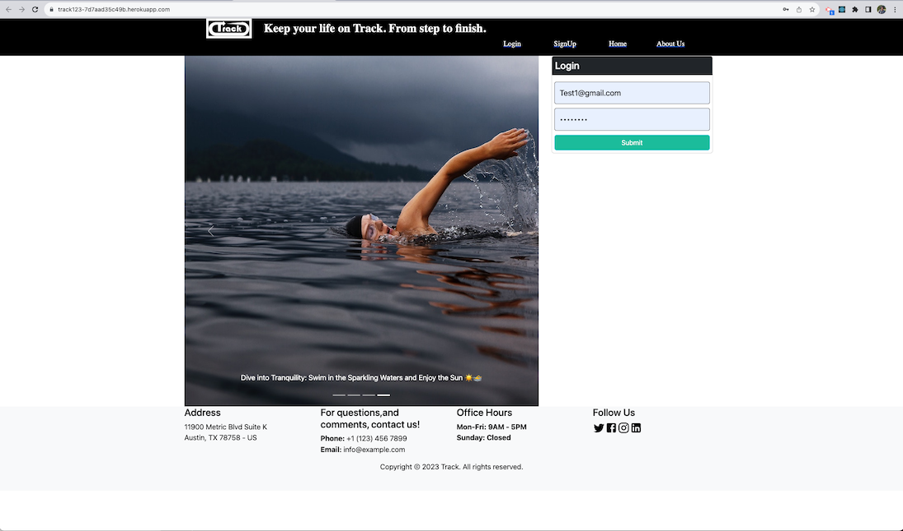
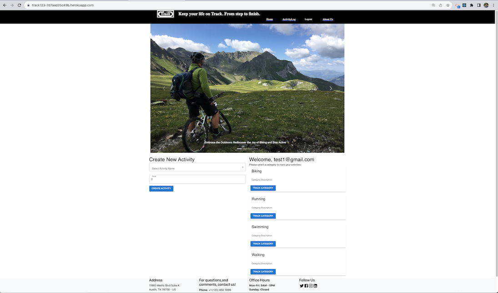
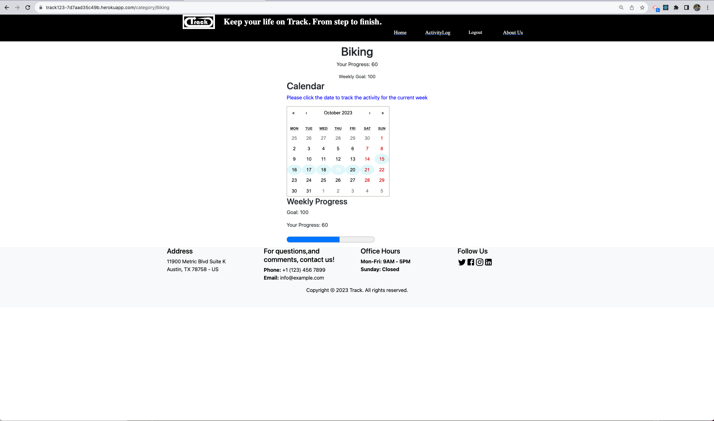
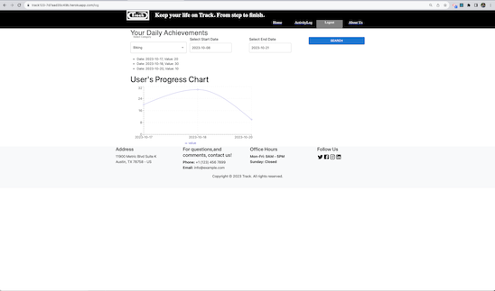
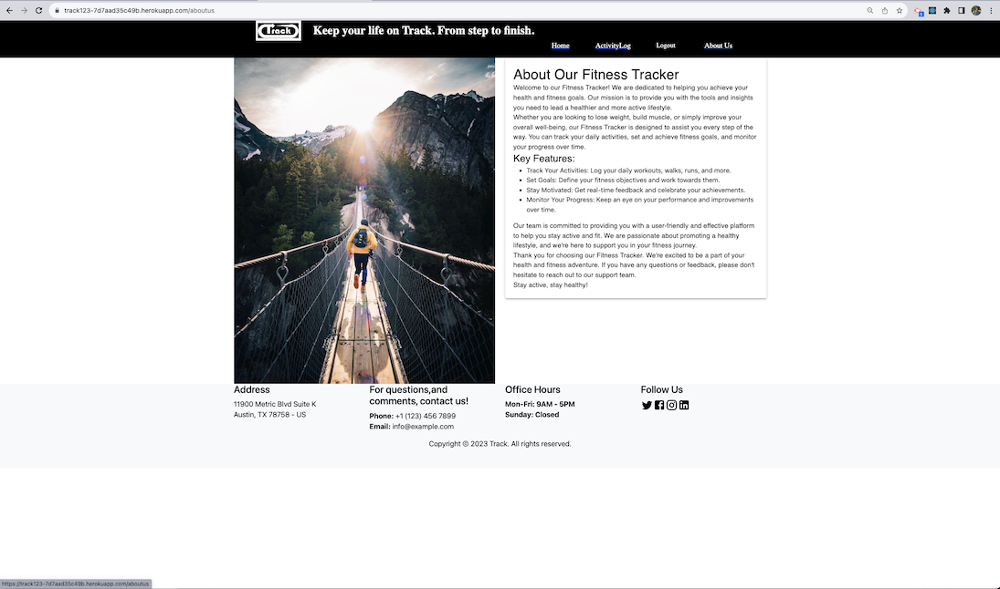

# "Track" MERN Full-Stack Application

## Description

     This is a collaborative final project for UT Coding Boot Camp utilizing MongoDB, Express, React, and NodeJS to build an application that allows users to track their fitness goals. We learned a lot about the interaction between React components and state management and how using actions and reducers simplifies our code.

## Table of Contents

[Installation](#installation)

[User Experience](#user-experience)

[App working example](#app-working-example)

[Contributing](#contributing)

[Technologies Used](#technologies-used)

[Usage](#usage)

[Questions](#questions)

[License](#license)

## Installation

 
 The link to the deployed application will take you directly to the site! 

## User Experience
 
 When a user visits the site they are prompted to *Login* or *Create an Account*.

Once a user has logged in, they are prompted to _Create_ a new goal or _View_ an existing goal. Users select one of three choices of activities in which they can create their goal. Activity choices are Running, Biking, and Swimming.

A user's goal consists of a distance in miles and a timeframe in days. Once the user has created a goal they may enter how much distance they covered for each day in their time frame.

The user's goal will display a progress bar that dynamically changes to reflect how much of their goal they have completed.

The user may close a goal at any time, at which point the goal will be closed to edits and saved in the _Previous Goals_ list which can be viewed by scrolling down on the page.

## App working example
[Video Link](https://drive.google.com/file/d/1wLAcQu9E04seL2sNGUIiUATJ1ePZXqFw/view)

## Contributing

Please contact us via the Questions section if you would like to contribute to this project.

## Technologies Used

The MERN stack has a three-layer architecture based on Model-View-Controller pattern and each interconnected layer performs a specific function in the application and this application is a MERN stack application which is a group of four technologies:-

- React JS for the front end, that is, the client (View) in which the user inputs data and the data display,
- GraphQL with a Node.js and Express.js server for the method called to store and retrieve data,
- MongoDB and Mongoose ODM for the database (Model) to store raw data and contains no logic.
- In addition, the following npm packages were installed to this application:-

  - Server (back end)

    - apollo-server-express (npm i apollo-server-express)
    - dotenv (npm install dotenv)
    - express (npm install express)
    - graphql (npm install graphql)
    - jsonwebtoken (npm install jsonwebtoken)
    - mongoose (npm install mongoose)

  - Client (front end)

    - reactstrap (npm install reactstrap react react-dom)
    - bootstrap (npm install --save bootstrap)
    - react Icons (npm install react-icons --save)
    - react (npm i react)
    - react toastify (npm install --save react-toastify)
    - jwt-decode (npm install jwt-decode)
    - validator (npm i validator)
    - react-router-dom (npm i react-router-dom)
    - react-scripts (npm i react-scripts)
    - moment (npm i moments)
    - graphql (npm install graphql)
    - apollo-link-context (npm i apollo-link-context)
    - apollo Client (npm i @apollo/client)
    - react apollo-hooks (npm install @apollo/react-hooks)

- Before deploying to Heroku, the application is run in develop mode and tested using GraphQL by entering at command prompt:-

  - npm run seed
  - npm run develop ( cd to the correct directory)

## Usage

To run tests, run the following command:
npm install

          npm run develop

Below are the screenshots of the walkthrough for fitness tracker.
- When the user load onto the website, sees login screen

  

- If user dow not have account, can click on signup screen

  

- Home screen for adding category and updating category buttons

  

- Updating activity or tracking activity

  

- User activity log by category

  

- About Us page

  

- Mobile View 
  

## License

https://img.shields.io/badge/license-3-green.svg

https://opensource.org/license/mit/

## Contributors

- http://github.com/Kumoko8
- https://github.com/DimitrBoldon
- https://github.com/RossiniTheRat
- https://github.com/rgadewar

## Repository

- [Project Repo](https://github.com/rgadewar/track/tree/Submission-V2)

## Heroku App

- https://track123-7d7aad35c49b.herokuapp.com/

## Questions 

If you have any questions about the repo, open an issue or contact me directly at email rupa@gadewar.com. You can find more of my work at
https://www.github.com/rgadewar

GitHub:http://github.com/Kumoko8

Email:tauen8@gmail.com

## License
MIT License: A permissive open-source license that allows users to use, modify, and distribute the code under certain conditions. It places minimal restrictions on the usage and is widely adopted in the open-source community.
